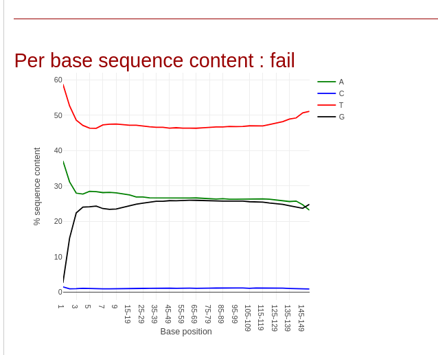
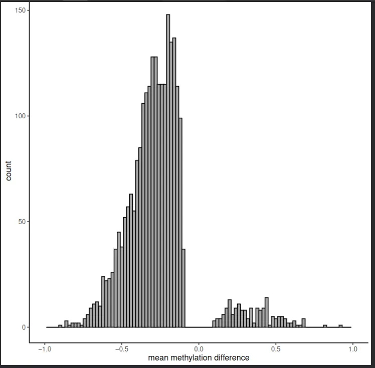
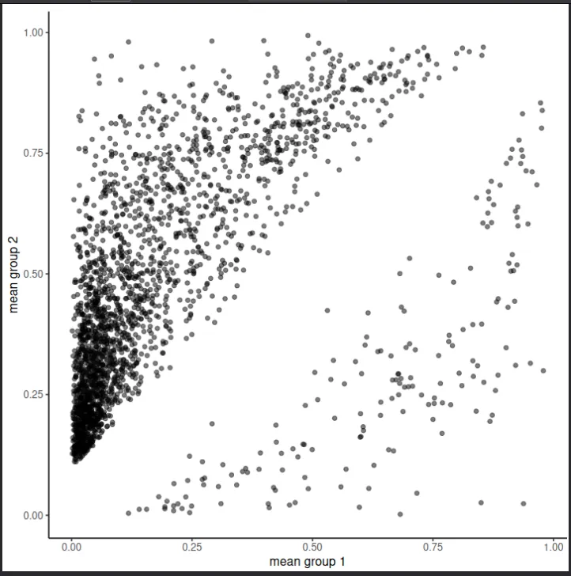
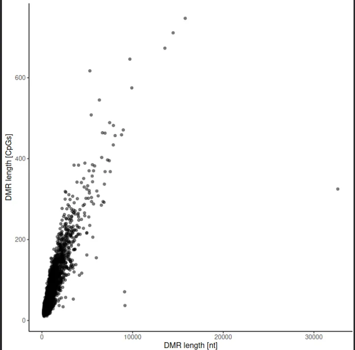

# Analysis 1 — WGBS Bisulfite Sequencing Pipeline

Whole-genome bisulfite sequencing (WGBS) analysis of breast cancer and normal breast tissue methylomes. Data sourced from **Lin et al. (2015)**. Pipeline executed on **Galaxy Europe** (`usegalaxy.eu`) following the Galaxy Training Network methylation-seq tutorial.

---

## Table of Contents

- [Biological Rationale](#biological-rationale)
- [Dataset](#dataset)
- [Pipeline Steps](#pipeline-steps)
  - [Step 1 — Quality Control (Falco)](#step-1--quality-control-falco)
  - [Step 2 — Bisulfite-Aware Alignment (bwameth)](#step-2--bisulfite-aware-alignment-bwameth)
  - [Step 3 — Methylation Extraction and Bias Assessment (MethylDackel)](#step-3--methylation-extraction-and-bias-assessment-methyldackel)
  - [Step 4 — Methylation Profiling (computeMatrix + plotProfile)](#step-4--methylation-profiling-computematrix--plotprofile)
  - [Step 5 — DMR Detection (Metilene)](#step-5--dmr-detection-metilene)
- [Summary of Findings](#summary-of-findings)
- [References](#references)

---

## Biological Rationale

### DNA Methylation in Breast Cancer

DNA methylation — the covalent addition of a methyl group to cytosine at CpG dinucleotides — is among the most well-characterised epigenetic modifications in cancer biology. In normal somatic cells, promoter CpG islands are maintained in an unmethylated state, permitting transcription factor access and gene expression. During oncogenesis, this equilibrium is disrupted in two coordinated but opposing ways:

1. **Focal hypermethylation** at promoter CpG islands silences tumour suppressor genes, replacing genetic mutation as a mechanism of loss of function.
2. **Global hypomethylation** across gene bodies, repetitive elements, and large partially methylated domains (PMDs) destabilises the genome and drives aberrant gene activation.

Lin et al. (2015) applied whole-genome bisulfite sequencing to characterise these changes at single-base resolution across normal breast tissue, fibroadenoma, invasive ductal carcinomas, and the MCF7 cell line. Their hierarchical clustering of hypomethylated regions (HMRs) identified tumour-specific methylation clusters and differentially methylated enhancers, with downstream effects on gene expression and X-chromosome inactivation.

### Why Bisulfite Sequencing?

Conventional DNA sequencing cannot distinguish methylated cytosine (5mC) from unmethylated cytosine — both read as C. Bisulfite treatment resolves this ambiguity through a chemical conversion:

- **Unmethylated cytosines** → deaminated to uracil → sequenced as **T**
- **Methylated cytosines** → chemically protected → sequenced as **C**

Comparing C vs T calls at each CpG position in aligned reads allows genome-wide reconstruction of the methylation state at single-base resolution.

---

## Dataset

**Source:** Lin et al. (2015) — ArrayExpress accession **E-MTAB-2014**
**Reference genome:** hg38 (GRCh38)
**Tutorial subset:** Chromosome 6 reads (for computational feasibility on shared Galaxy servers)

| Sample ID | Tissue Type | Experimental Group |
|-----------|-------------|-------------------|
| NB1 | Normal breast | Control |
| NB2 | Normal breast | Control |
| BT089 | Invasive ductal carcinoma | Case |
| BT126 | Invasive ductal carcinoma | Case |
| BT198 | Invasive ductal carcinoma | Case |
| MCF7 | Breast cancer cell line | Case |

---

## Pipeline Steps

### Step 1 — Quality Control (Falco)

**Tool:** Falco v1.2.4
**Input:** Raw FASTQ files (`subset_1.fastq`, `subset_2.fastq`)
**Purpose:** Assess raw read quality and verify successful bisulfite conversion

Falco (a computationally efficient FastQC alternative) evaluates per-base quality scores, GC content, sequence length distribution, and — critically for bisulfite data — per-base sequence composition.

In a correctly treated bisulfite library, the per-base composition plot deviates markedly from the expected uniform distribution. Cytosine (C) is depleted to near zero, while thymine (T) is elevated to approximately 50%. This pattern is not a quality defect but the expected and required signature of complete bisulfite conversion, confirming that unmethylated cytosines have been fully converted prior to sequencing.

**Figure 01 — Per-base sequence content, Read 1:**

*Per-base nucleotide composition for `subset_1.fastq`. Cytosine frequency approaches zero and thymine rises to ~50% across all positions, confirming complete bisulfite conversion of the forward read.*

**Figure 02 — Per-base sequence content, Read 2:**

*Corresponding composition for `subset_2.fastq`. The same conversion signature is observed in the reverse read, confirming library-wide bisulfite treatment.*

---

### Step 2 — Bisulfite-Aware Alignment (bwameth)

**Tool:** bwameth v0.2.7
**Reference:** hg38
**Purpose:** Align bisulfite-converted reads to the reference genome while accounting for C→T and G→A conversions

Standard short-read aligners (BWA-MEM, Bowtie2) cannot accurately align bisulfite reads because C→T conversion introduces apparent mismatches against an unconverted reference, dramatically reducing mapping efficiency and introducing systematic alignment bias.

bwameth addresses this by performing in-memory 3-letter conversion of the reference genome (C→T on the forward strand; G→A on the reverse strand) and aligning reads accordingly, then reporting alignments in standard BAM format with full methylation context preserved. This approach handles all four possible bisulfite strand orientations (OT, OB, CTOT, CTOB) without requiring separate genome indices.

The output is a coordinate-sorted BAM file per sample, which is passed to MethylDackel for methylation extraction.

---

### Step 3 — Methylation Extraction and Bias Assessment (MethylDackel)

**Tool:** MethylDackel v0.5.2
**Input:** Sorted BAM files from bwameth
**Output:** bedGraph files with per-CpG methylation percentage and read coverage
**Purpose:** Extract per-CpG methylation calls and assess positional methylation bias

MethylDackel traverses each aligned read in the BAM file and, at each CpG position, records whether the cytosine was retained (methylated) or converted to thymine (unmethylated). It outputs a bedGraph-format file with columns: chromosome, start, end, methylation percentage, methylated read count, and unmethylated read count.

**Methylation Bias Assessment (`mbias`):**
Some bisulfite library preparation protocols introduce positional bias — artificially elevated or depressed methylation calls at the 5′ or 3′ ends of reads — due to end-repair artefacts or incomplete conversion at read termini. The `mbias` function plots average CpG methylation percentage as a function of read position to detect such biases. If present, affected positions are excluded from methylation extraction.

**Figure 03 — Methylation bias, original top strand:**

*MethylDackel mbias output for the original top strand across paired reads. CpG methylation is stable at 70–75% across all read positions with no significant positional trend at either read terminus. This confirms the absence of end-repair bias and indicates that no positional trimming is required prior to methylation extraction.*

---

### Step 4 — Methylation Profiling (computeMatrix + plotProfile)

**Tools:** computeMatrix v3.5.4, plotProfile v3.5.4
**Input:** BigWig methylation tracks, CpG island BED annotations
**Purpose:** Visualise average methylation levels relative to genomic features

computeMatrix calculates per-base methylation signal in defined windows around genomic features — here, CpG islands and their associated transcription start sites (TSS). plotProfile then renders the average methylation curve across all features in the reference BED file.

This approach reveals the global relationship between genomic context and methylation state, and allows direct comparison across samples.

**Figure 04 — Methylation profile, single sample:**

*Average methylation around CpG islands for the subset sample. The characteristic dip centred on the TSS reflects the biologically required hypomethylation of active promoter CpG islands. Unmethylated CpG island promoters are permissive for transcription factor binding; their methylation leads to stable gene silencing.*

**Figure 05 — Methylation profile, all six samples:**

*plotProfile output across all six samples (NB1, NB2, BT089, BT126, BT198, MCF7). The TSS dip is present and deep in normal breast tissue (NB1, NB2), reflecting intact promoter hypomethylation. In cancer samples (BT089, BT126, BT198, MCF7), the dip is markedly attenuated — indicating aberrant CpG island promoter hypermethylation consistent with the tumour suppressor gene silencing described in Lin et al. (2015).*

---

### Step 5 — DMR Detection (Metilene)

**Tool:** Metilene v0.2.6.1
**Comparison:** Group 1 = normal breast (NB1, NB2) vs Group 2 = invasive ductal carcinoma (BT198)
**Purpose:** Identify genomic regions with statistically significant differential methylation between groups

Metilene applies a binary segmentation algorithm to identify contiguous CpG-dense genomic regions where the mean methylation level differs significantly between the two sample groups. Each reported DMR includes: genomic coordinates, mean methylation per group, methylation difference, q-value (Benjamini–Hochberg adjusted), CpG count, and region length in base pairs.

**Figure 06 — DMR methylation difference distribution:**

*Distribution of mean methylation differences (cancer − normal) across all detected DMRs. The distribution is left-skewed, with more DMRs showing negative differences (hypomethylation in cancer relative to normal) than positive ones. This confirms that global hypomethylation is the dominant methylation change in invasive ductal carcinoma, consistent with the PMD hypomethylation and HMR expansion described in Lin et al. (2015). A smaller right-sided peak of hypermethylated DMRs is also present, representing focal promoter hypermethylation events.*

**Figure 07 — DMR length distribution (nucleotides):**

*Distribution of DMR lengths in base pairs. Most DMRs fall in the kilobase range, consistent with the kilobase-scale HMR expansions and contractions reported in the Lin et al. dataset.*

**Figure 08 — DMR length distribution (CpG count):**

*Distribution of DMR lengths measured by number of CpG sites spanned. The CpG-count distribution tracks closely with the nucleotide-length distribution, as expected for regions of approximately uniform CpG density.*

**Figure 09 — Mean methylation difference vs q-value:**

*Scatter plot of mean methylation difference vs −log₁₀(q-value) for all detected DMRs. The most significantly differentially methylated regions — predominantly hypomethylated — reach q-values below 1×10⁻¹⁰⁰, reflecting the magnitude and consistency of methylation loss across cancer samples at these loci.*

**Figure 10 — Group 1 vs Group 2 mean methylation:**

*Mean methylation in normal breast (Group 1, x-axis) vs invasive ductal carcinoma (Group 2, y-axis) at each DMR. Deviation from the diagonal represents differential methylation. Points above the diagonal represent hypermethylation in cancer; points below represent hypomethylation in cancer. The predominance of points below the diagonal reinforces the hypomethylation-dominant pattern.*

**Figure 11 — DMR length in nucleotides vs CpG count:**

*Bivariate plot of DMR nucleotide length vs CpG count. The positive linear relationship is expected. Deviations from the trend line indicate regions with unusually high CpG density (CpG islands) or unusually sparse CpG density (gene bodies, intergenic regions).*

---

## Summary of Findings

| Step | Key Finding | Biological Interpretation |
|------|-------------|--------------------------|
| QC (Falco) | C → ~0%, T → ~50% per base | Complete bisulfite conversion confirmed |
| Alignment (bwameth) | Successful alignment to hg38 | Bisulfite-aware alignment required for accuracy |
| Bias (MethylDackel) | Stable 70–75% CpG methylation across all positions | No positional artefact; no trimming required |
| Profiles (plotProfile) | TSS dip attenuated in cancer vs normal | Aberrant promoter CpG island hypermethylation in cancer |
| DMRs (Metilene) | Left-skewed difference distribution; q < 1×10⁻¹⁰⁰ for top DMRs | Dominant global hypomethylation in cancer, with focal hypermethylation |

These findings recapitulate the central epigenomic features of breast cancer methylomes described in Lin et al. (2015) and are consistent with the broader cancer epigenomics literature: a landscape of global hypomethylation punctuated by focal promoter hypermethylation at tumour suppressor loci.

---

## References

- Lin, I.-H. et al. (2015). Hierarchical Clustering of Breast Cancer Methylomes Revealed Differentially Methylated and Expressed Breast Cancer Genes. *PLOS ONE*, 10(2), e0118453. https://doi.org/10.1371/journal.pone.0118453
- Galaxy Training Network. DNA Methylation data analysis. https://training.galaxyproject.org/training-material/topics/epigenetics/tutorials/methylation-seq/tutorial.html
- Galaxy Europe: https://usegalaxy.eu

