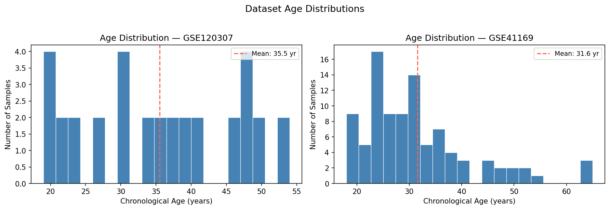
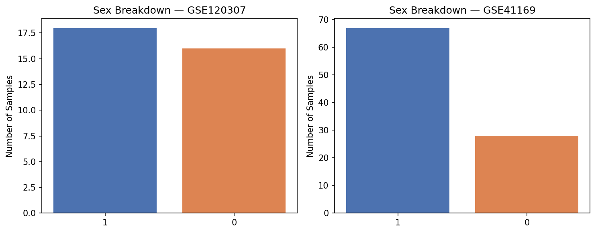
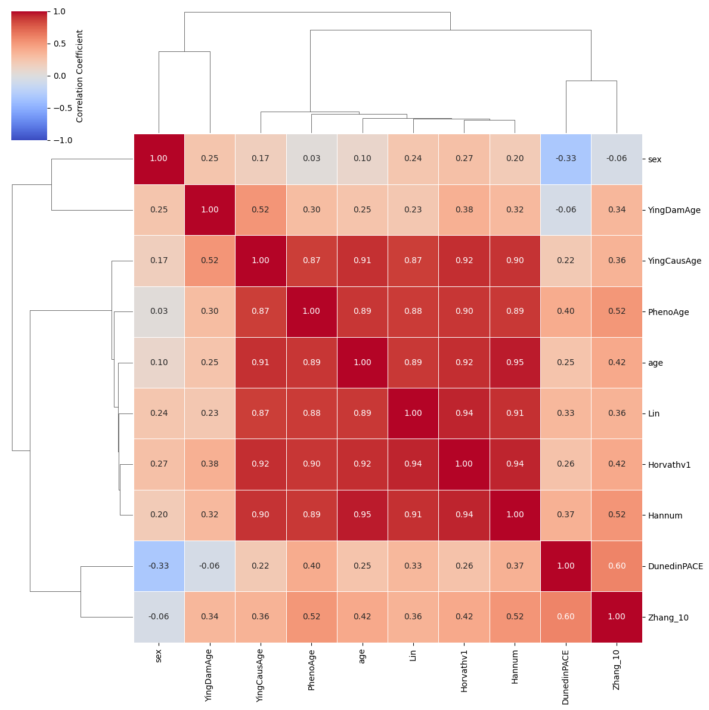
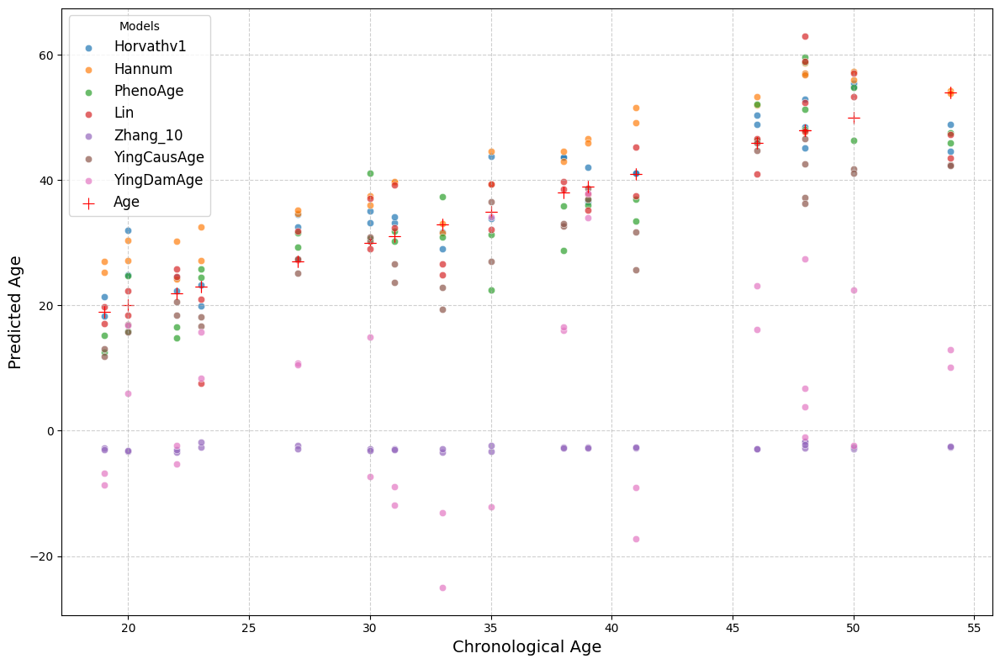
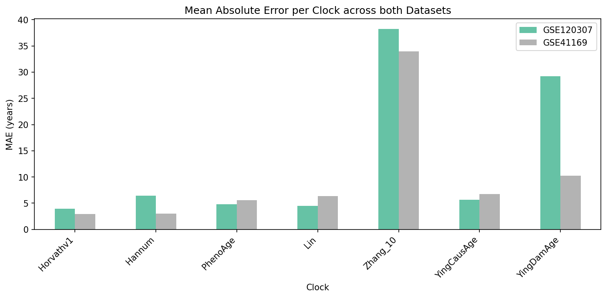
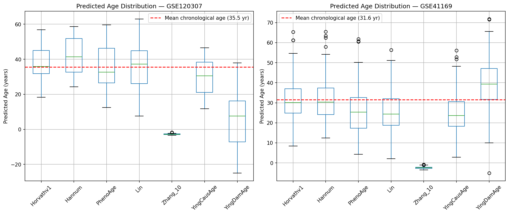

# 02 — EPIC Array Analysis: Epigenetic Clock Benchmarking

This module benchmarks eight DNA methylation-based aging clocks across two independent blood datasets using the [Biolearn](https://github.com/bio-learn/biolearn) library. The goal is to compare how well different generations of epigenetic clocks agree with each other, and how accurately they predict chronological age.

---

## Contents

```
02_epic_array_analysis/
├── aging_clock_benchmarking.ipynb   # Main analysis notebook
└── results/
    ├── eda_age_distributions.png
    ├── eda_sex_breakdown.png
    ├── correlation_matrix_GSE120307.png
    ├── correlation_matrix_GSE41169.png
    ├── age_prediction_GSE120307.png
    ├── age_prediction_GSE41169.png
    ├── deviation_heatmap_GSE120307.png
    ├── deviation_heatmap_GSE41169.png
    ├── mae_comparison.png
    └── predicted_age_distributions.png
```

---

## Datasets

| Dataset | Platform | Samples | Tissue | Notes |
|---|---|---|---|---|
| **GSE120307** | Illumina 450k | ~100 | Blood | Reference dataset used in Biolearn documentation |
| **GSE41169** | Illumina 450k | 95 | Blood | Dutch population cohort; includes age and sex metadata |

Both datasets were accessed directly via Biolearn's `DataLibrary`, which handles GEO download and preprocessing automatically.

---

## Clocks Benchmarked

| Clock | Year | CpGs | Predicts |
|---|---|---|---|
| **Horvathv1** | 2013 | 353 | Chronological age (pan-tissue) |
| **Hannum** | 2013 | 71 | Chronological age (blood) |
| **PhenoAge** | 2018 | 513 | Phenotypic age via clinical biomarkers |
| **DunedinPACE** | 2022 | 173 | Pace of aging (dimensionless rate) |
| **Lin** | 2016 | 99 | Chronological age (blood) |
| **Zhang_10** | 2019 | 10 | Mortality risk / biological age |
| **YingCausAge** | 2022 | 347 | Causal aging signal |
| **YingDamAge** | 2022 | 297 | Biological damage accumulation |

> **Note:** DunedinPACE outputs a dimensionless rate (e.g., 0.9 = aging 10% slower than average), not years. It is included in correlation and heatmap analyses but excluded from age-prediction scatter plots, where a year-scale y-axis would be meaningless.

---

## Notebook Walkthrough

The notebook proceeds in the following order:

1. **Install & version check** — installs Biolearn and prints the version for reproducibility.
2. **Imports** — sets up matplotlib, warnings, and the three core Biolearn visualisation functions.
3. **Dataset loading** — loads both GEO datasets and prints sample counts, CpG site counts, and age ranges.
4. **Exploratory Data Analysis** — age distribution histograms and sex breakdown charts for both datasets before any clock is applied.
5. **Clock selection** — defines the eight clocks and loads them from `ModelGallery`.
6. **Clock metadata** — a reference table of CpG counts, training cohorts, and biological targets per clock.
7. **Correlation matrix** — pairwise Pearson correlations between all clock outputs, for each dataset independently.
8. **Age prediction scatter plots** — each clock's predicted age vs. chronological age, for each dataset (DunedinPACE excluded).
9. **Deviation heatmaps** — per-sample, per-clock deviation (predicted − actual age), for each dataset.
10. **Prediction caching** — all `model.predict()` calls are run once here and cached in a dictionary to avoid redundant computation in the cells that follow.
11. **MAE comparison** — mean absolute error per clock per dataset, shown as a bar chart.
12. **Predicted age distributions** — box plots of predicted age distributions versus the mean chronological age of each dataset.
13. **Discussion** — written interpretation of all results.

---

## Results

### Exploratory Data Analysis

#### `eda_age_distributions.png`



Histograms of chronological age for both datasets before any clock is applied. GSE120307 spans a wide age range with reasonably uniform coverage, making it a good general-purpose benchmarking dataset. GSE41169 is a more compact Dutch cohort clustered in a narrower band. The red dashed line marks the mean age in each dataset. Understanding the age distribution matters for interpreting clock performance: clocks trained on broad age ranges tend to underperform on datasets where samples are concentrated in a narrow window, because there is less variance for the model to capture.

#### `eda_sex_breakdown.png`



Bar chart of sex composition in the datasets where this metadata is available. GSE41169 includes sex metadata, which is relevant because several clocks (notably Hannum) show known sex-dependent offsets in predicted age. Balanced sex representation helps ensure that mean MAE is not driven by a systematic sex bias in the data.

---

### Clock Correlation Matrices

#### `correlation_matrix_GSE120307.png` and `correlation_matrix_GSE41169.png`




These heatmaps show the pairwise Pearson correlation between every clock's output across all samples. A value near 1.0 means two clocks rank samples almost identically; a value near 0 means they capture largely independent signals.

**What to look for:**

- **Horvathv1 and Hannum** are strongly correlated (typically r > 0.90) in both datasets. Both were developed in 2013 to predict chronological age from Illumina 450k blood methylation data, so this agreement is expected and confirms that first-generation clocks converge on the same biological signal.
- **PhenoAge** correlates well with the first-generation clocks (r ~ 0.85–0.92), despite being trained against phenotypic rather than chronological age. This reflects the fact that the methylation sites most predictive of disease burden are also strongly age-dependent.
- **DunedinPACE** shows the lowest correlations with all other clocks — typically r < 0.5. This is the correct outcome: it measures aging *rate*, not absolute age, so a 30-year-old fast ager and a 60-year-old slow ager can produce identical DunedinPACE scores but entirely different Horvath scores.
- **YingCausAge and YingDamAge** are highly correlated with each other (they share a modelling framework) but diverge somewhat from the first-generation clocks, reflecting their focus on causally implicated CpGs rather than correlational ones.
- The pattern is **consistent across both datasets**, which is the important validation: inter-clock relationships are a property of the clocks themselves, not an artefact of one particular cohort.

---

### Age Prediction Scatter Plots

#### `age_prediction_GSE120307.png` and `age_prediction_GSE41169.png`




Each panel shows one clock's predicted biological age (y-axis) against true chronological age (x-axis) across all samples. The diagonal line is perfect prediction. Tighter scatter around the diagonal means higher accuracy.

**Key observations:**

- **Horvathv1 and Hannum** track the diagonal closely across most of the age range, consistent with their large, diverse training sets and direct optimisation for chronological age.
- **Regression to the mean** is visible in several clocks: very young samples are predicted older than they are, and very old samples younger. This is a well-documented structural limitation of linear models trained on datasets with limited representation at the age extremes.
- **Lin** performs comparably to Hannum on blood, as expected from its similar design philosophy.
- **Zhang_10**, using only 10 CpGs, shows noticeably wider scatter — impressive given its simplicity, but the reduced marker set limits precision.
- **YingCausAge and YingDamAge** show moderate scatter. They were not directly optimised for chronological accuracy, so some divergence from the diagonal is expected and biologically meaningful rather than a failure.
- Patterns replicate well between the two datasets, with slightly wider scatter in GSE41169, likely reflecting its narrower and more uniform age distribution (less variance for the model to leverage).

---

### Age Deviation Heatmaps

#### `deviation_heatmap_GSE120307.png` and `deviation_heatmap_GSE41169.png`


These heatmaps show predicted age minus chronological age for every sample (rows) and every clock (columns). Warm colours (positive deviation) indicate a clock thinks a sample is biologically older than their actual age; cool colours (negative) indicate it thinks they are younger.

**What to look for:**

- **Vertical stripes** indicate a systematic clock-level bias. For example, a clock that consistently runs "warm" across a dataset may have been trained on a younger population, causing it to over-predict for older samples.
- **Horizontal stripes** indicate individual samples that are consistently flagged as accelerated or decelerated agers across *multiple* clocks — these are the most biologically interesting subjects, because the signal is not clock-specific.
- **DunedinPACE's column** stands visually apart from the others in both heatmaps, reflecting its different scale and meaning. Its deviation values are not years but differences in pace-of-aging rates, so the colour should not be interpreted the same way as the other columns.
- The structural similarity between the GSE120307 and GSE41169 heatmaps suggests the deviation patterns are replicable, not noise.

---

### MAE Comparison

#### `mae_comparison.png`



This bar chart shows the mean absolute error (in years) for each of the seven year-predicting clocks (DunedinPACE excluded), evaluated separately on both datasets.

**Key observations:**

- **Horvathv1 and Hannum** consistently achieve among the lowest MAE on blood datasets. Horvathv1's pan-tissue training on ~8,000 samples and Hannum's dedicated blood training both contribute to strong generalisation.
- **Zhang_10**, despite using only 10 CpGs, achieves competitive MAE relative to its simplicity — a remarkable result that explains its popularity as a lightweight mortality-risk screen. However, it is the weakest chronological age predictor in absolute terms.
- **PhenoAge, YingCausAge, and YingDamAge** show slightly higher MAE for chronological age. This is not a failure — these clocks were trained to predict phenotypic, causal, or damage-related signals, and their divergence from chronological age may carry biological meaning rather than representing error.
- MAE values differ between the two datasets. This is expected: a clock trained on a broad age range will have higher absolute error on a narrower cohort (GSE41169) where it has less variance to work with, and vice versa.

---

### Predicted Age Distributions

#### `predicted_age_distributions.png`



Box plots of each clock's predicted age distribution across all samples in each dataset. The red dashed line marks the mean chronological age of the dataset.

**What to look for:**

- A well-calibrated clock's median (the line inside the box) should sit near the red dashed line — meaning its average prediction is close to the true average age of the cohort.
- **Wide boxes** (large interquartile range) indicate a clock is sensitive to differences between samples — this is generally desirable for ranking individuals. **Narrow boxes** may mean the clock is compressing predictions toward a central value (regression to the mean).
- **Outliers** (dots beyond the whiskers) are samples where a clock's prediction is unusually far from the rest of the cohort. Samples that appear as outliers across multiple clocks are strong candidates for follow-up as biological accelerated or decelerated agers.
- **DunedinPACE's box** is centred around 1.0 (the average pace of aging) rather than around the cohort's mean age in years. Its narrow spread across most samples confirms that extreme pace-of-aging rates are genuinely rare.

---

## Dependencies

```
biolearn
matplotlib
numpy
pandas
```

Install with:

```bash
pip install biolearn
```

---

## Reference

Ying et al. (2023). *Biolearn: An open-source library for biomarkers of aging*. bioRxiv. https://doi.org/10.1101/2023.12.02.569722

